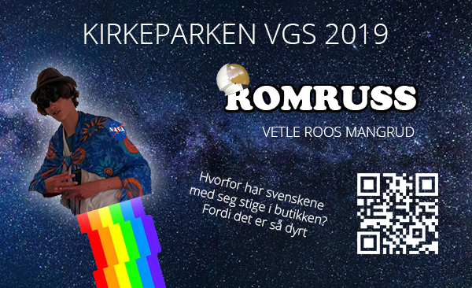

# Russekort

## What is a russekort?

In Norway we have a tradition where we become "russ" after graduating during about a month. When you are a russ you party a lot and wear special clothes signaling to everyone that you are a russ (Search russ on Google). You also make a card called a "russekort", that is like a business card where you write som fun stuff. Kids love collecting russekort!

Sadly, a lot of russ write inappropriate stuff on their russekort (sex, drinking, swearing), and that is not cool! However, some russekort are really creative, and I remember collecting some awesome ones as a child. Inspired by some of them, I set out to make a sick russekort when I was a russ.

## My russekort

The russekort contains a game made in HTML5 with [Phaser](https://phaser.io/). I came up with the idea pretty close to the deadline, so the game is basically a ripoff of [This tutorial by Jared York](https://learn.yorkcs.com/build-a-space-shooter-with-phaser-3/). Thanks Jared ♥

Play the game [here](https://vetlem.com/russ/). Keep in mind it is made for touch control.
